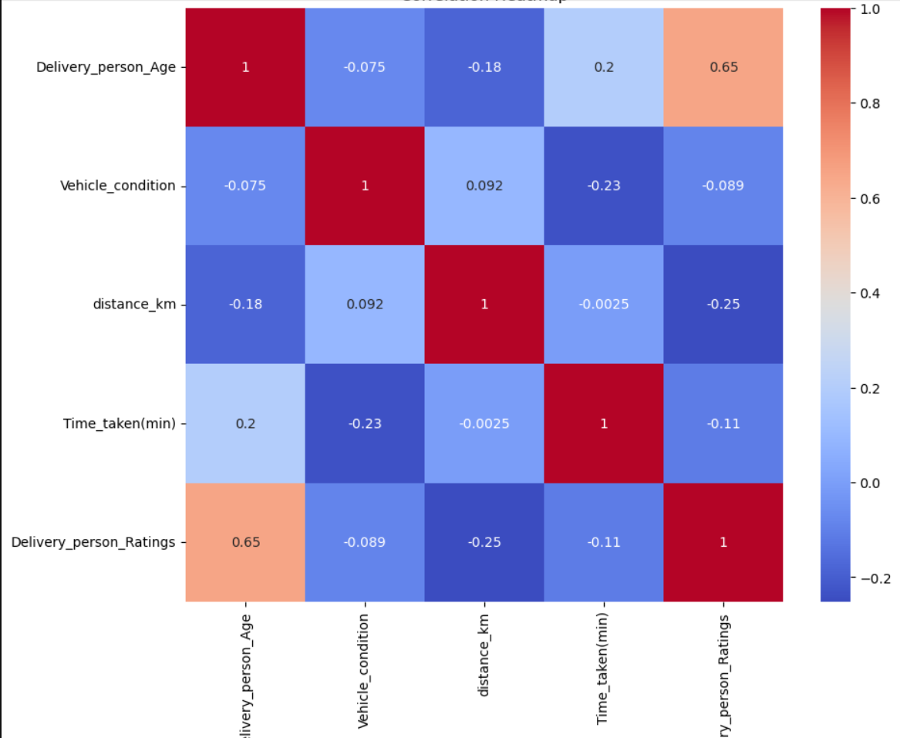

# 🚀 Delivery Time Prediction using Machine Learning

A machine learning project that predicts food delivery time with high accuracy using advanced ensemble models and real-world features.

## 📌 Project Overview
This project focuses on predicting food delivery time using machine learning techniques. The goal is to analyze various real-world factors such as traffic conditions, weather, delivery partner details, and distance to estimate accurate delivery duration.

---

## 📊 Dataset Description
- Contains 45,000+ records
- Includes 20+ features

### Key Features:
- Delivery partner age and ratings  
- Restaurant & delivery location coordinates  
- Order and pickup time  
- Traffic density and weather conditions  
- Vehicle type and multiple deliveries  
- City type (Urban, Semi-Urban, Metropolitan)

Target variable:  
**Time_taken (minutes)**

---

## ⚙️ Project Workflow
1. Data Cleaning & Preprocessing  
2. Handling Missing Values  
3. Feature Engineering (distance, time features)  
4. Encoding & Feature Scaling  
5. Model Training & Evaluation  

---

## 🤖 Machine Learning Models Used
- Linear Regression  
- Ridge & Lasso Regression  
- Decision Tree Regressor  
- Random Forest Regressor  
- K-Nearest Neighbors (KNN)  
- AdaBoost Regressor  
- Gradient Boosting  
- XGBoost  
- LightGBM  
- CatBoost  

---

## 🏆 Best Performing Models
- LightGBM  
- CatBoost  
- AdaBoost  

📈 Achieved R² Score ≈ **0.82**

---

## 📈 Key Insights
- Traffic and distance significantly impact delivery time  
- Semi-urban areas have longer delivery durations  
- Festivals increase delivery time due to high demand  
- Weather has minimal impact on order volume  

---

## 📂 Project Files
- `report.pdf` → Detailed project report  
- `delivery_model.py` → Model implementation code  

---

## 💡 Conclusion
Tree-based and boosting algorithms performed significantly better than linear models due to the non-linear nature of the dataset. Proper feature engineering and preprocessing played a crucial role in improving model performance.

---
## 📊 Visual Insights

### Delivery Time Distribution

### Traffic Impact

### Heat Map

## 👩‍💻 Author
**Apoorva Sharma**.
