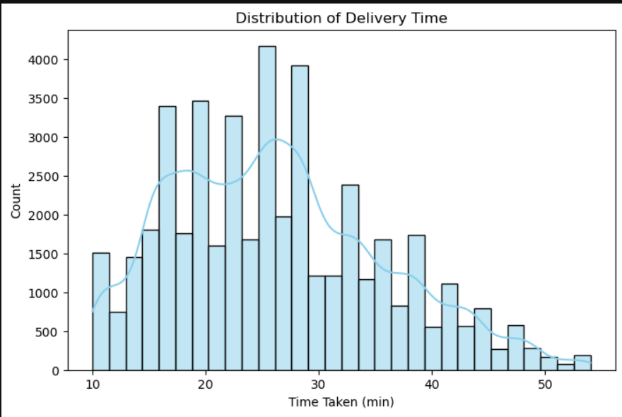
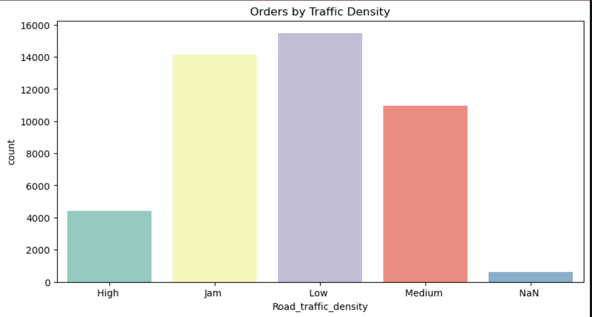

# 🚀 Delivery Time Prediction using Machine Learning

Built a machine learning model to predict food delivery time using 45,000+ records and real-world features like traffic, weather, and distance.
Achieved ~82% R² score using advanced ensemble models like LightGBM and CatBoost.

## 📌 Project Overview

This project contains two parts:

### 1. Exploratory Data Analysis & Model Training (Notebook)
- Multiple ML algorithms tested (Random Forest, XGBoost, etc.)
- Feature engineering with full dataset
- Model comparison performed

### 2. Deployment (Streamlit App)
- Final deployed model: Random Forest Regressor
- Uses selected important features only
- Optimized for real-time prediction and simplicity

---

## 📊 Dataset Description
- Contains 45,000+ records
- Includes 20+ features

### Key Features:
- Delivery partner age and ratings  
- Restaurant & delivery location coordinates  
- Order and pickup time  
- Traffic density and weather conditions  
- Vehicle type and multiple deliveries  
- City type (Urban, Semi-Urban, Metropolitan)

Target variable:  
**Time_taken (minutes)**

---

## ⚙️ Project Workflow
1. Data Cleaning & Preprocessing  
2. Handling Missing Values  
3. Feature Engineering (distance, time features)  
4. Encoding & Feature Scaling  
5. Model Training & Evaluation  

---
## 🛠️ Tech Stack
- Python
- Pandas, NumPy
- Matplotlib, Seaborn
- Scikit-learn
- XGBoost, LightGBM, CatBoost

  
## 🤖 Machine Learning Models Used
- Linear Regression  
- Ridge & Lasso Regression  
- Decision Tree Regressor  
- Random Forest Regressor  
- K-Nearest Neighbors (KNN)  
- AdaBoost Regressor  
- Gradient Boosting  
- XGBoost  
- LightGBM  
- CatBoost  

---

## 🏆 Best Performing Models
- LightGBM  
- CatBoost  
- AdaBoost  

📈 Achieved R² Score ≈ **0.82**

---

## 📈 Key Insights
- Traffic and distance significantly impact delivery time  
- Semi-urban areas have longer delivery durations  
- Festivals increase delivery time due to high demand  
- Weather has minimal impact on order volume  

---

## 📁 Dataset
Dataset contains 45,000+ delivery records with features related to traffic, weather, and delivery conditions.

--

## 📂 Project Files
- `report.pdf` → Detailed project report  
- `delivery_model.py` → Model implementation code  

---

## 💡 Conclusion
Tree-based and boosting algorithms performed significantly better than linear models due to the non-linear nature of the dataset. Proper feature engineering and preprocessing played a crucial role in improving model performance.

---
## 📊 Visual Insights

### Delivery Time Distribution

### Traffic Impact

### Heat Map

--

## ▶️ How to Run

1. Clone the repository
2. Install dependencies:
   pip install -r requirements.txt
3. Run the notebook or Python file

--

## 🚀 Future Improvements
- Deploy model using Streamlit
- Integrate real-time traffic APIs
- Build live delivery prediction system

--
  
## 👩‍💻 Author
**Apoorva Sharma**.
